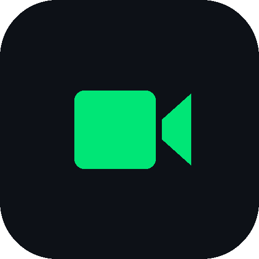

# MobCam - OBS Camera

  
    
  <h3>Turn Your Android Phone into a Studio-Grade Camera for OBS Studio</h3>
  

    <strong>Ultra-Low Latency Mode &bull; 4K UHD &bull; 60 FPS &bull; In-OBS Remote Controls</strong>
  

  

    
    
    
  

---

## 🌐 Official Website & Live Demo
Visit the production website: **[https://ybrdigital.github.io/mobcam/](https://ybrdigital.github.io/mobcam/)**

---

## 🚀 Key Highlights

- **Ultra-Low Latency Mode**: Optimized real-time streaming engine engineered for both 5 GHz Wi-Fi and wired USB tethering with zero jitter.
- **In-OBS Quick Controls Dock**: Integrated browser dock (`http://localhost:4752/`) inside OBS Studio (`Docks > MobCam Controls`) to toggle flash, zoom presets (1x, 1.5x, 2x), autofocus modes, and exposure compensation remotely.
- **Auto 16:9 Landscape Lock**: Automatically locks your video orientation into horizontal widescreen when streaming starts, preventing black vertical pillarboxes.
- **Studio Quality**: Supports 1080p and 4K UHD at up to 60 FPS with hardware-accelerated AVC/H.264, HEVC/H.265, and MJPEG encoding.
- **Synchronized 48 kHz Audio**: Crystal-clear microphone capture with timestamp audio synchronization directly into the OBS Audio Mixer.
- **100% Local Peer-to-Peer**: No cloud servers, no intermediate relays. Video and audio packets stream solely over your local network or USB link.

---

## 📦 Downloads & Releases

### Latest Release: v1.0.0 (Stable)

| Artifact | File | Size | Checksum (SHA-256) |
|---|---|---|---|
| **Windows OBS Plugin Setup** | [MobCam-OBS-Plugin-v1.0.0-Setup.exe](assets/downloads/v1.0.0/MobCam-OBS-Plugin-v1.0.0-Setup.exe) | 2.1 MB | `A33CD424E25D638B5BA3920264BE76C270F2B61FD7E0014817AEA5D5F84BFEEB` |
| **Android Application** | [Install on Google Play](https://play.google.com/store/apps/details?id=com.ybrdigital.mobcam) | — | Official Google Play Store Release |

> *Note: The MobCam Android mobile application is distributed exclusively through the Google Play Store.*

---

## 🛠️ System Requirements

### Android Device (Mobile Client)
- **Minimum OS**: Android 8.0 Oreo (API Level 26)
- **Recommended OS**: Android 10+ with Camera2 HAL3 / CameraX 1.4 support
- **Encoding**: Hardware MediaCodec (H.264 / HEVC / MJPEG)
- **Ports**: TCP `4747` (Stream), HTTP `4752` (OBS Dock)

### Windows PC (OBS Studio Plugin)
- **Operating System**: Windows 10 / Windows 11 (64-bit)
- **OBS Studio**: OBS Studio 28.0 - 31.0+ (64-bit native)

---

## ⚙️ Quick Connection Guide

1. **Install Android App**: Install MobCam exclusively from the [Google Play Store](https://play.google.com/store/apps/details?id=com.ybrdigital.mobcam).
2. **Install Windows Plugin**: Run `MobCam-OBS-Plugin-v1.0.0-Setup.exe` with OBS Studio closed.
3. **Connect via USB (Lowest Latency)**:
   - Connect phone via USB cable.
   - Enable **USB Tethering** in Android Settings.
   - MobCam auto-detects the tethered network link.
4. **Connect via Wi-Fi**:
   - Ensure phone and PC are on the same 5 GHz Wi-Fi network.
5. **Add Source in OBS Studio**:
   - In OBS, click **+** under Sources &rarr; **MobCam Source**.
   - Select your phone from the dropdown list and click **OK**.
6. **Open Controls Dock**:
   - In OBS, go to **Docks** &rarr; **MobCam Controls** (or open `http://localhost:4752/`).

---

## 📜 Support & Legal

- **Developer**: Yash Rayjada
- **Support Email**: [info@ybrdigital.in](mailto:info@ybrdigital.in)
- **Privacy Policy**: [ybrdigital.in/mobcam/privacy-policy](http://ybrdigital.in/mobcam/privacy-policy)
- **Terms of Service**: [ybrdigital.in/mobcam/terms-of-service](https://ybrdigital.in/mobcam/terms-of-service)
